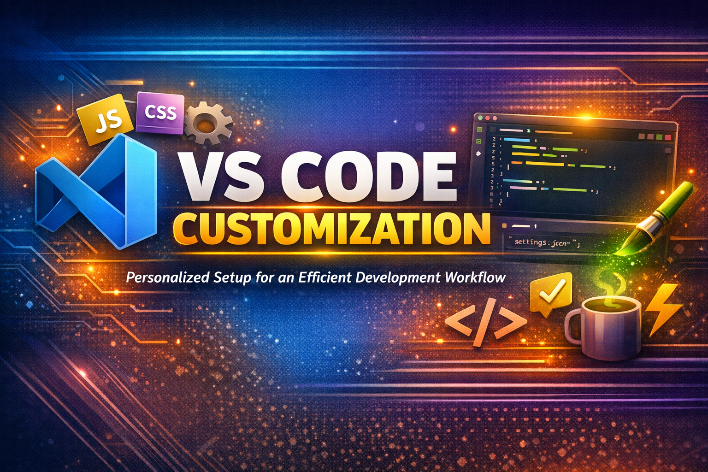
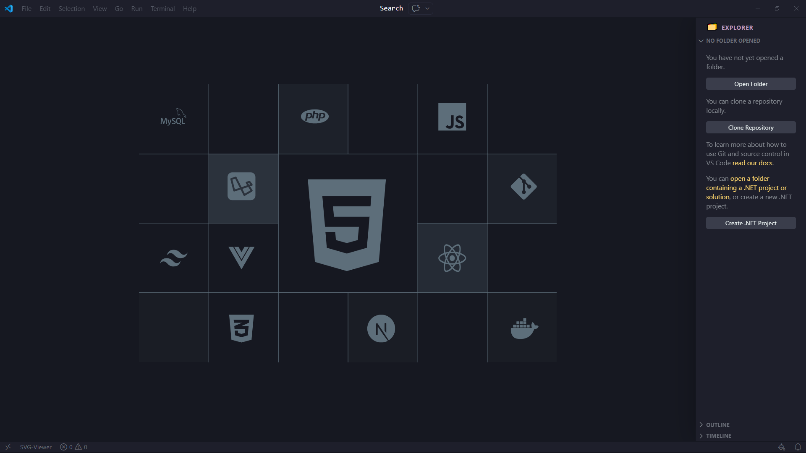
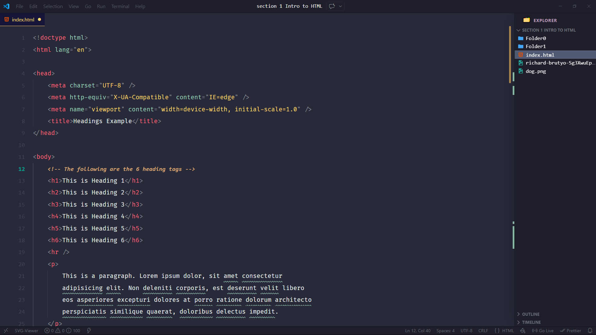
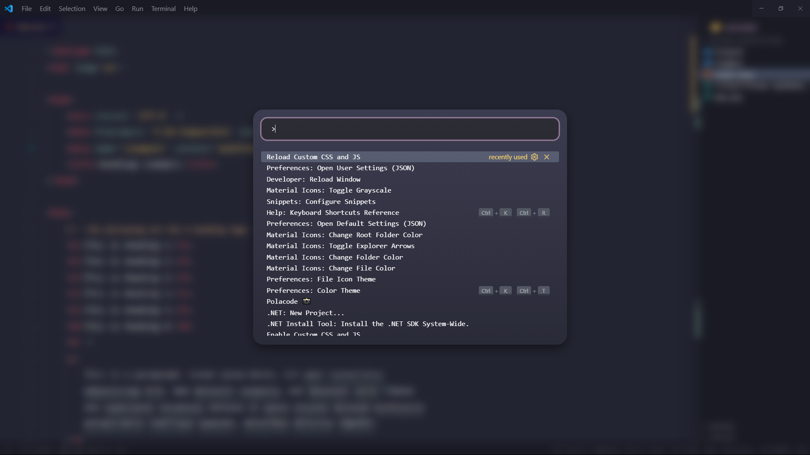
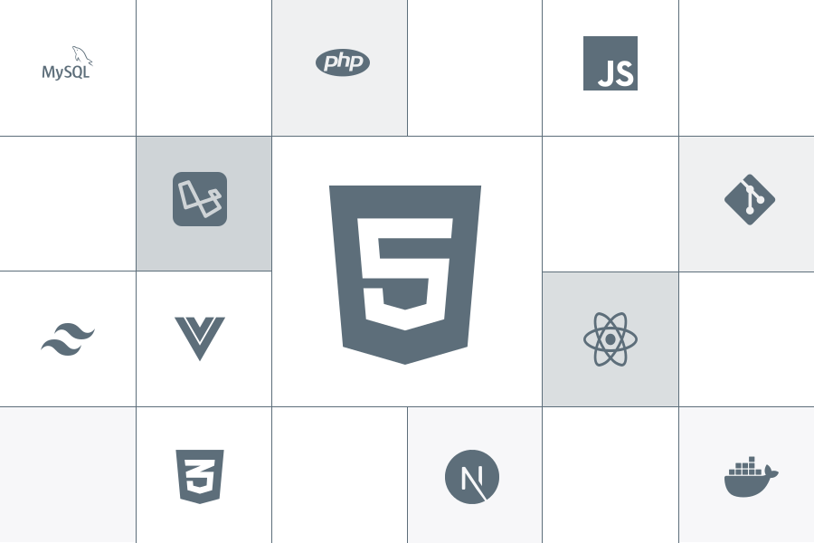

# 🛠️ VS Code Customization



> Custom Visual Studio Code setup including themes, settings, extensions, snippets, and productivity tweaks for a clean and efficient development workflow.

---






---

## 📁 Repository Structure

```
vs-code-customization/
└── assets/
    ├── new-window.png          # vs code new window Image
    ├── coding-example.png      # vs code coding example Image
    └── command-palette.png     # vs code command palette Image
├── settings.json               # VS Code user settings
├── custom-vs-code.css          # Custom CSS for VS Code UI
├── vs-code-script.js           # Custom JS injected into VS
└── art.svg                     # Custom artwork / branding
```

---

## 🚀 Getting Started

### Prerequisites

- [Visual Studio Code](https://code.visualstudio.com/) installed
- [Custom CSS and JS Loader](https://marketplace.visualstudio.com/items?itemName=be5invis.vscode-custom-css) extension installed _(required for CSS/JS customization)_

### Setup

1. **Clone the repository**

    ```bash
    git clone https://github.com/Vijaykumar-Muppirisetti/VS-Code-customization.git
    ```

2. **Copy `settings.json`** to your VS Code user settings directory:
    - **Windows:** `%APPDATA%\Code\User\settings.json`
    - **macOS:** `~/Library/Application Support/Code/User/settings.json`
    - **Linux:** `~/.config/Code/User/settings.json`

3. **Place the CSS and JS files** somewhere accessible on your machine (e.g., your home directory or a dedicated config folder).

4. **Configure Custom CSS and JS Loader** — in your `settings.json`, point to the files:

    ```json
    "vscode_custom_css.imports": [
      "file:///absolute/path/to/custom-vs-code.css",
      "file:///absolute/path/to/vs-code-script.js"
    ]
    ```

5. **Enable Custom CSS and JS Loader** — open the Command Palette (`Ctrl+Shift+P` / `Cmd+Shift+P`) and run:

    ```
    Enable Custom CSS and JS
    ```

6. **Reload VS Code** when prompted.

---

## 🎨 Theme

| Setting    | Value                   |
| ---------- | ----------------------- |
| Theme      | **Monokai Pro**         |
| Filter     | **Octagon**             |
| Icon Theme | **Material Icon Theme** |

---

## 🧩 Extensions

### ✦ Appearance & Theming

| Extension           | Publisher    |
| ------------------- | ------------ |
| Monokai Pro         | monokai      |
| Material Icon Theme | Philipp Kief |

### ✦ Code Formatting & Quality

| Extension                 | Publisher            |
| ------------------------- | -------------------- |
| Prettier — Code Formatter | Prettier             |
| ESLint                    | Microsoft            |
| Beautify Blade            | ShalokShalom         |
| Code Spell Checker        | Street Side Software |

### ✦ IntelliSense & Snippets

| Extension                                | Publisher     |
| ---------------------------------------- | ------------- |
| HTML CSS Support                         | ecmel         |
| IntelliSense for CSS Class Names in HTML | Zignd         |
| Tailwind CSS IntelliSense                | Tailwind Labs |
| Next JS/TS Snippets                      | iJS           |

### ✦ UI & Visual Helpers

| Extension       | Publisher  |
| --------------- | ---------- |
| Color Highlight | Naumovs    |
| Image Preview   | Kiss Tamás |
| TODO Highlight  | Wayou Liu  |

### ✦ Developer Tools & Utilities

| Extension           | Publisher          |
| ------------------- | ------------------ |
| Auto Rename Tag     | Jun Han            |
| Code Runner         | Jun Han            |
| CodeSnap            | adpyke             |
| Live Server         | Ritwick Dey        |
| JSON                | ZainChen           |
| Draw.io Integration | Henning Dieterichs |

### ✦ Customization (Core)

| Extension                | Publisher |
| ------------------------ | --------- |
| Custom CSS and JS Loader | be5invis  |

---

## ⚙️ Settings Highlights

The `settings.json` file includes personal tweaks for:

- Font family and size preferences
- Editor formatting on save
- Custom CSS and JS Loader file paths
- Theme and icon configuration
- Prettier and ESLint integration
- Workspace and terminal settings

> Refer to the `settings.json` file directly for the full configuration.

---

## 📝 Notes

- Running **Custom CSS and JS Loader** modifies VS Code's core files. VS Code may show a warning that it is _"corrupted"_ — this is expected and safe to ignore or suppress using the **Fix VSCode Checksums** extension.
- Re-enable the custom styles after every VS Code update.

---

## 📄 License

This project is open-source and available under the Copyright (c) 2026 Vijay Kumar MIT License.


MIT License

Permission is hereby granted, free of charge, to any person obtaining a copy
of this software and associated documentation files (the "Software"), to deal
in the Software without restriction, including without limitation the rights
to use, copy, modify, merge, publish, distribute, sublicense, and/or sell
copies of the Software, and to permit persons to whom the Software is
furnished to do so, subject to the following conditions:

The above copyright notice and this permission notice shall be included in all
copies or substantial portions of the Software.

THE SOFTWARE IS PROVIDED "AS IS", WITHOUT WARRANTY OF ANY KIND, EXPRESS OR
IMPLIED, INCLUDING BUT NOT LIMITED TO THE WARRANTIES OF MERCHANTABILITY,
FITNESS FOR A PARTICULAR PURPOSE AND NONINFRINGEMENT. IN NO EVENT SHALL THE
AUTHORS OR COPYRIGHT HOLDERS BE LIABLE FOR ANY CLAIM, DAMAGES OR OTHER
LIABILITY, WHETHER IN AN ACTION OF CONTRACT, TORT OR OTHERWISE, ARISING FROM,
OUT OF OR IN CONNECTION WITH THE SOFTWARE OR THE USE OR OTHER DEALINGS IN THE
SOFTWARE.
